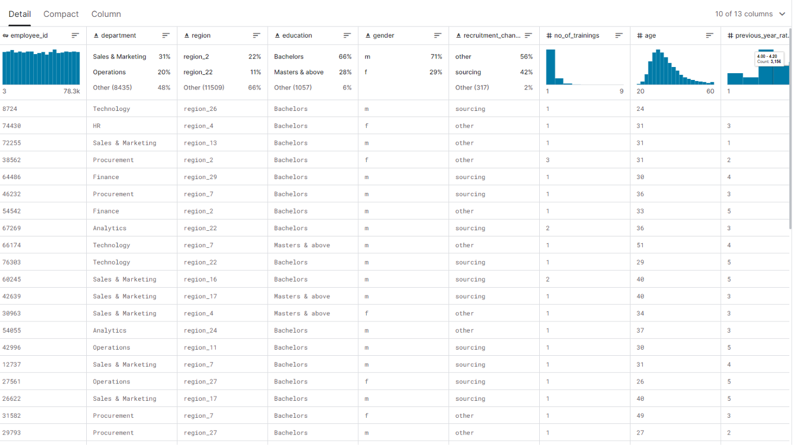

# Proyek Sistem Pendukung Keputusan using Weighted Product - Studi Kasus Promosi Kandidat Karyawan

## Metode Wegihted Product
Dalam Sistem Pengambil Keputusan, metode Weighted Product muncul sebagai alat yang berguna untuk memberikan pemahaman yang lebih mendalam. WP adalah salah satu metode pengambilan keputusan yang memungkinkan penimbangan bobot pada setiap kriteria, yang kemudian digunakan untuk mengevaluasi dan membandingkan alternatif yang ada. Konsep dasar WP diantaranya melibatkan normalisasi data dan perhitungan nilai produk untuk setiap alternatif, yang kemudian digunakan untuk menghasilkan vektor Preferensi Relatif (Vi) yang menentukan peringkat alternatif. Dalam konteks proyek ini, maka akan diimplementasikan Weighted Product pada data yang telah dipilih, dengan tujuan memberikan peringkat Kandidat Karyawan sebagai alternatif-alternatif yang ada berdasarkan kriteria tertentu yang diukur.

## Studi Kasus
Studi kasus berfokus pada industri teknologi, khususnya dalam manajemen karyawan. 
Seiring dengan pertumbuhan perusahaan di bidang teknologi, manajemen karyawan menjadi aspek 
krusial untuk menjaga keberlanjutan operasional dan inovasi. Dengan jumlah karyawan yang 
bervariasi, dari yang berpengalaman hingga yang baru bergabung, perusahaan perlu 
mengidentifikasi karyawan yang memiliki potensi untuk dipromosikan atau mendapatkan tindakan 
lebih lanjut. Tujuan utama dari studi kasus ini adalah memberikan landasan metodologis, dan 
Weighted Product dipilih sebagai metode evaluasi yang dapat menyaring karyawan berdasarkan 
kriteria-kriteria tertentu. 
Dalam konteks ini, metode Weighted Product digunakan untuk menilai dan 
membandingkan karyawan-karyawan berdasarkan sejumlah atribut yang relevan dengan kriteria 
promosi. Penggunaan metode ini memungkinkan perusahaan untuk memberikan bobot yang sesuai 
dengan tingkat signifikansi masing-masing kriteria, sehingga pengambilan keputusan promosi 
dapat dilakukan dengan lebih objektif. Studi kasus ini mencerminkan tantangan umum dalam 
industri teknologi, di mana keberhasilan perusahaan tidak hanya ditentukan oleh teknologi yang 
digunakan, tetapi juga oleh keunggulan sumber daya manusia yang dimilikinya.

## Sumber Data
Sumber data yang digunakan dalam projek ini diambil dari Kaggle berikut : https://www.kaggle.com/datasets/sanjanchaudhari/employees-performance-for-hr-analytics

##  Proses Analisis 
Proses analisis pertama yang dilakukan adalah melakukan seleksi atribut pada sumber data. 
Dimana tidak semua atribut yang terdapat pada sumber data tidak diperlukan dalam menentukan 
keputusan. Dari 12 atribut pada sumber data, diambil 7 diantaranya, yakni Previous Year Rating, 
Training Score, Length of Service, Awards, No of Training, Age, dan Key Performance Indikator 
(KPI) dengan alasan bahwa atribut-atribut tersebut terkait langsung dengan kinerja dan kontribusi 
positif dari karyawan terhadap perusahaan. Atribut-atribut yang dipakai merupakan kriteria final 
yang akan dipilih dalam pemeringkatan untuk promosi karyawan. 
Setelah kriteria yang akan dipakai telah ditentukan, selanjutnya adalah dilakukan 
perangkingan serta pemberian bobot pada masing- masing kriteria tersebut. Dari analisis yang 
dilakukan, diperoleh perangkingan sebagai berikut :  
1. Previous Year Rating  dengan bobot 0.20 
2. Training Score dengan bobot 0.18 
3. Length of dengan bobot Service 0.18 
4. Awards dengan bobot 0.14 
5. No of Trainings dengan bobot 0.1 
6. Age dengan bobot 0.1 
7. KPI dengan bobot 0.1 
Setelah masing-masing kriteria telah dirangking dan diberi bobot, selanjutnya adalah 
membuat Tabel Bobot Kriteria ID Karyawan yang akan dipilih untuk Promosi Jabatan dengan 7 Kriteria dan 10 Kandidat Karyawan.

Pada file Laporan, terdapat 3 Versi Perhitungan dalam Implementasi Metode Wegihted Product :
1. Perhitungan manual menggunakan rumus
2. Menggunakan Fungsi Excel
3. Membangun model Weigthed Product menggunakan Pytohn

Berikut merupakan Langkah - Langkah menggunakan Python dalam membangun model Weighted Product:
1. Import Library dan Class WeightedProduct
2. Membuat Class WeightedProductModel 
3. Membuat Fungsi normalize_data 
4. Membuat Fungsi calculate_product_values  
5. Membuat Fungsi calculate_si_vector, calculate_vi_vector & Fungsi Dataframe Hasil
6. Membuat Fungsi rank_alternatives
7. Input 10 Data sampel dalam bentuk array
8. Menginstansiasi Model dan Hasil

## Result

